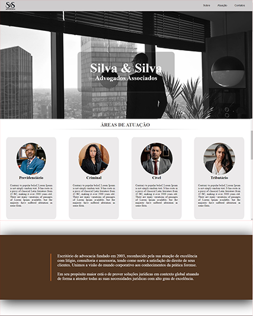
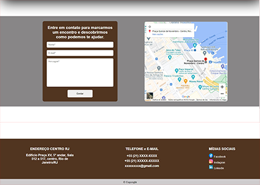

<h1 align="center"> LANDING PAGE </h1>

<h2>OBJETIVO</h2>

Criar uma landing page responsiva, utilizando flexbox e com menu hambúrguer. Adicionei varias divs, formulário, o google maps e links para redes sociais.

Para esse projeto usei HTML, CSS e JavaScript (para o menu hamburguer).

<h2> RESULTADO</h2>

<h2>ACESSE</h2>

[Silva & Silva (tstavale.github.io)](https://tstavale.github.io/Landing_page/)

<h2>FERRAMENTAS</h2>

<ul>
  <li>HTML</li>

  <li>CSS</li>

  <li>JavaScript</li>
</ul>
